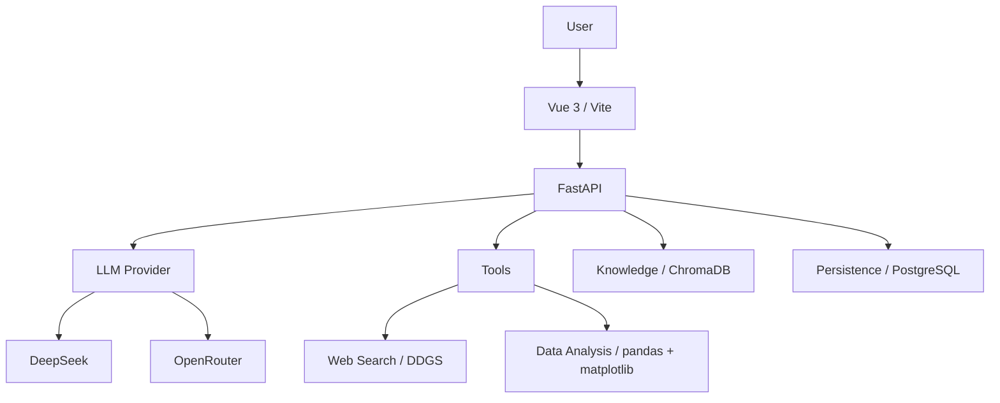

# Personal AI Workspace

## Overview

Personal AI Workspace is a local full stack chat application built with Vue and FastAPI. It provides workspace scoped chat history, knowledge retrieval, current web search, and safe CSV/XLSX analysis through backend controlled Tool Calling.

## Screenshots

The repository currently includes an architecture image but no maintained product screenshot. Add release screenshots only after completing the manual acceptance checklist.

## Features

### Multi-model Chat

- DeepSeek and OpenRouter through a shared provider interface
- Per request model selection and per Workspace default model
- Server Sent Events streaming, stop support, persisted history, and token usage

### Workspace

- Workspace scoped chats, files, system prompt, default model, and capability settings
- Backend enforced switches for Web Search and Data Analysis
- Default Workspace protection and transactional deletion of ordinary Workspaces

### Knowledge Base / RAG

- TXT, Markdown, PDF, and DOCX ingestion
- Local or OpenAI compatible embeddings
- ChromaDB retrieval scoped by Workspace
- Knowledge citations built from retrieved chunk metadata

### Web Search

- `search_web(query: string)` through DDGS
- Up to five validated HTTP/HTTPS results
- Web citations use URLs returned by DDGS

### Data Analysis

- CSV and XLSX loading with pandas and openpyxl
- Whitelisted statistics, grouping, sorting, and top N operations
- bar, line, pie, and scatter charts generated by matplotlib
- No model generated Python, `eval`, `exec`, shell, or arbitrary filesystem paths

### Citation

- `type: "knowledge"` for ChromaDB chunks
- `type: "web"` for DDGS results
- Web links open in a new tab; knowledge sources show filename, chunk index, and preview

## Architecture



Tool execution is bounded to four rounds. The backend validates enabled tools and their arguments before execution. Tool control text is buffered and is not emitted as assistant content.

## Tech Stack

- Vue 3, Vite, TypeScript, Tailwind CSS
- FastAPI, Pydantic, OpenAI compatible SDK
- PostgreSQL, ChromaDB, FastEmbed
- DDGS
- pandas, openpyxl, matplotlib

## Project Structure

```text
backend/
  app/api/routes/       HTTP and SSE endpoints
  app/core/             configuration and persistence
  app/providers/        DeepSeek/OpenRouter adapters
  app/rag/              loading, chunking, embeddings, retrieval
  app/services/         Web Search and Data Analysis services
  app/tools/            Tool schemas, registration, execution
  app/tests/            backend regression tests
frontend/
  src/components/       chat, settings, navigation, UI primitives
  src/lib/              chat and Workspace state
  src/pages/            application pages
```

## Setup

### Prerequisites

- Python 3.11+
- Node.js 20+
- pnpm 9
- PostgreSQL

### Backend

```powershell
cd backend
Copy-Item .env.example .env
python -m venv .venv
.\.venv\Scripts\Activate.ps1
pip install -r requirements.txt
python -m uvicorn app.main:app --host 127.0.0.1 --port 8000
```

Configure `DEEPSEEK_API_KEY`, `DATABASE_URL`, and `POSTGRES_TARGET_PASSWORD` in `backend/.env`. Configure `OPENROUTER_API_KEY` only when OpenRouter is needed. Local embeddings are the default and download their model on first use.

The application still accepts legacy OpenAI compatible chat environment names for existing installations. New installations should use the documented DeepSeek or OpenRouter variables.

### Frontend

```powershell
cd frontend
Copy-Item .env.example .env
pnpm install --frozen-lockfile
pnpm dev
```

The default frontend URL is `http://localhost:5173`. `VITE_API_BASE_URL` defaults to `http://127.0.0.1:8000`.

### PostgreSQL

Create the application database and role before starting FastAPI. The schema is initialized automatically. The required application tables are:

- `workspaces`
- `chat_sessions`
- `chat_messages`
- `token_usage`

Keep the password in `POSTGRES_TARGET_PASSWORD`; do not commit it or place it in frontend variables.

## Usage

1. Create or select a Workspace.
2. Choose a default or per chat model.
3. Enable Web Search or Data Analysis in Workspace Settings when needed.
4. Upload knowledge documents for RAG, or CSV/XLSX files for Data Analysis.
5. Start a chat. Sources and generated charts appear below the assistant response.

CSV and XLSX files are retained as analysis inputs and are not embedded into ChromaDB.

## Environment Variables

Backend variables are documented in `backend/.env.example`; frontend variables are in `frontend/.env.example`. Copy each example to `.env` and fill only the services you use. Never expose provider keys through `VITE_` variables.

Web Search uses DDGS and does not require `BRAVE_SEARCH_API_KEY`.

## Testing

```powershell
cd backend
.\.venv\Scripts\python.exe -m pytest -q

cd ..\frontend
npx vue-tsc --noEmit
npm run build
```

## Security Design

- Workspace capability switches are enforced by the backend.
- Tool schemas reject missing, extra, mistyped, and out of range arguments.
- Data Analysis accepts a Workspace file ID, never a caller controlled path.
- Analysis operations and chart types use fixed allowlists.
- File size, row count, and column count are bounded.
- Web citation URLs are taken from validated DDGS results.
- RAG retrieval and deletion filter by Workspace metadata.
- Assistant Markdown is sanitized with DOMPurify.
- `.env`, local databases, vector data, uploaded files, generated charts, caches, and build output are ignored by Git.

This V1 has no authentication or multi-user isolation and is intended for a trusted local deployment.

## Roadmap

- Authentication and multi-user authorization
- Operational rate limiting and observability
- Lifecycle management for persisted chat chart references
- OCR and additional knowledge file formats

Image Generation remains a placeholder and is outside the V1 release scope.
